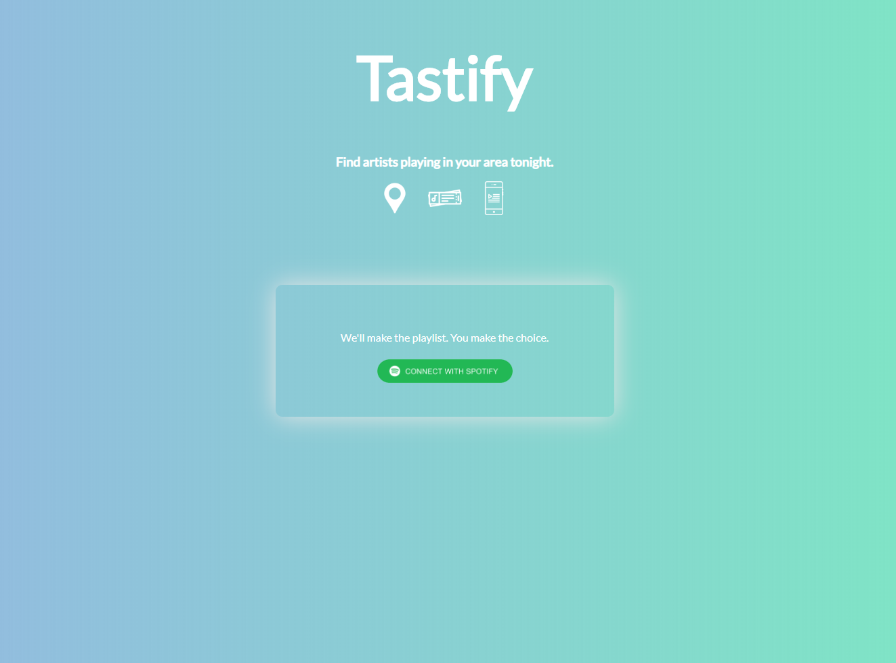
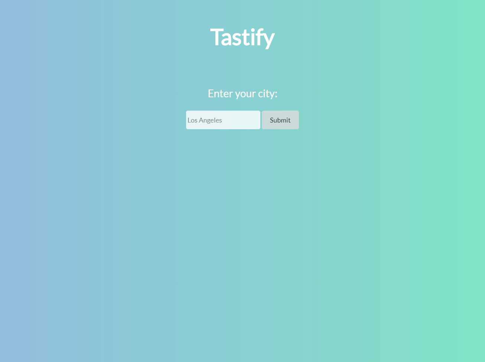
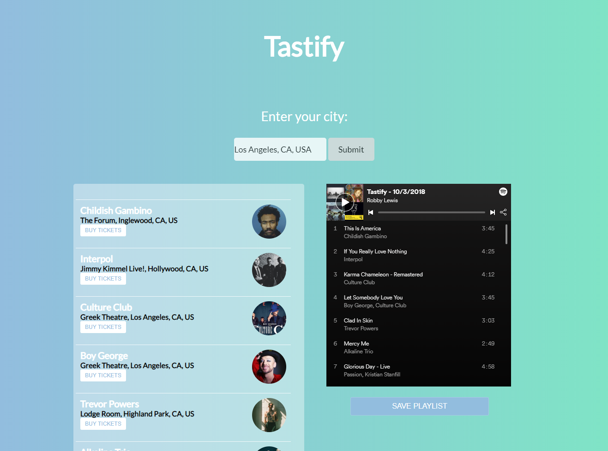

# Tastify

Tastify is a client-side web app that allows you to search for artists playing in your area and will populate a Spotify playlist based off of who is playing that night.

# Live Demo
The app is hosted on Heroku: <a href = "https://tastify--robbylewis.repl.co/">Live Demo</a>

# Screenshots

<h2>Landing page</h2>

City search page

Results page

